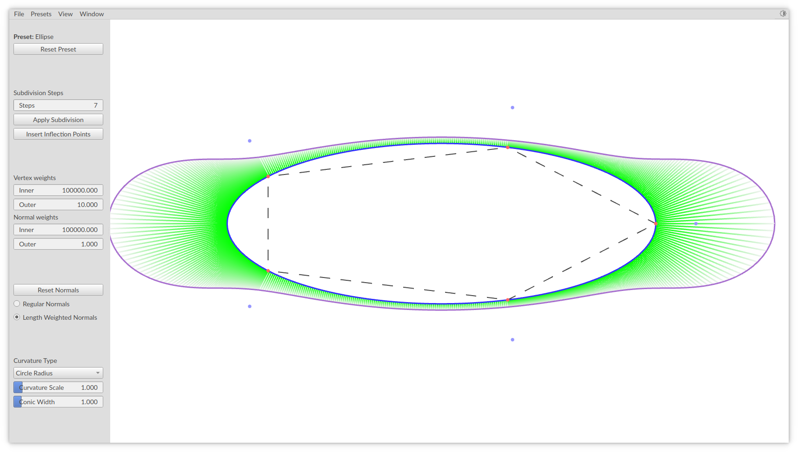
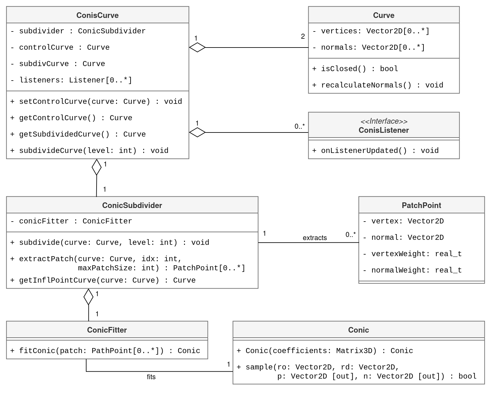

# Conis: A library for Conic Curve Subdivision

Repository containing the implementation of a conic subdivision scheme for curves. This framework was the basis for the paper: [A point-normal interpolatory subdivision scheme preserving conics](https://doi.org/10.1016/j.cagd.2024.102347).

The program supports the loading of object files (provided that the `.obj` file contains a single 2D curve).



## Prerequisites

To compile and run the project, you need a number of dependencies. Basic instructions are provided for Ubuntu-based distros, Fedora-based distros and MacOS. If you plan to run this on Windows, install [WSL](https://learn.microsoft.com/en-us/windows/wsl/install) and follow the instructions for the Ubuntu-based distros.

In addition to the packages below, the GUI application will also require OpenGL to run, but this should be available by default on most systems.

### 1. [CMake](https://cmake.org/)

- **Ubuntu-based distros**:

     ```bash
     sudo apt-get install -y cmake
     ```

- **Fedora-based distros**:

     ```bash
     sudo dnf install -y cmake
     ```

- **Mac (using Homebrew)**:

     ```bash
     brew install cmake
     ```

---

### 2. [Eigen](https://eigen.tuxfamily.org/index.php?title=Main_Page)

- **Ubuntu-based distros**:

     ```bash
     sudo apt-get install -y libeigen3-dev
     ```

- **Fedora-based distros**:

     ```bash
     sudo dnf install -y eigen3-devel
     ```

- **Mac (using Homebrew)**:

     ```bash
     brew install eigen
     ```

---

### 3. [Qt 6.2+](https://www.qt.io/)

   Qt is required for running the program with a GUI. It is optional for building the core library.

- **Ubuntu-based distros**:

     ```bash
     sudo apt-get install -y qt6-base-dev qt6-tools-dev
     ```

     > Note that you will need at least Ubuntu 22 for the qt6 packages to be available.

- **Fedora-based distros**:

     ```bash
     sudo dnf install -y qt6-qtbase-devel qt6-qttools-devel
     ```

- **Mac (using Homebrew)**:

     ```bash
     brew install qt6
     ```

### 4. [Google Test (GTest)](https://github.com/google/googletest)

   Google Test is required for running unit tests. Pass `-DBUILD_UNIT_TESTS=OFF` to the `cmake` command to skip this requirement.

- **Ubuntu-based distros**:

     ```bash
     sudo apt-get install -y libgtest-dev
     ```

- **Fedora-based distros**:

     ```bash
     sudo dnf install -y gtest-devel
     ```

- **Mac (using Homebrew)**:

     ```bash
     brew install googletest
     ```

## Getting Started

To start, clone the repository and initialise its submodules:

```bash
git clone https://github.com/BugelNiels/conic-subdivision.git
cd conic-subdivision
git submodule update --init
```

### Quick Start

To build and run:

```shell
./build.sh -r
```

> Note that not all GPUs support doubles in shaders. To disable this, use the `--disable-shader-double-precision` flag. The resulting shaders might be slightly less accurate. The docker image build disables this by default.

### Compilcation

Compilation can be done easily via the provided build script:

```shell
./build.sh
```

See `./build.sh --help` for more information on how to use the build script.

#### Manual Compilation

Alternatively, you can compile it manually (note that this does not create a _release_ build):

```bash
mkdir build
cd build
cmake .. -DBUILD_UNIT_TESTS=OFF -DCMAKE_BUILD_TYPE=Release
make -j6
```

The generated binary will be named `build/conisLauncher`. You can run the program by running this binary:

```sh
./conisLauncher
```

### Running Through Docker

It is also possible to run the application through Docker. This might be useful if you don't want to install the above dependencies on your system or if you have troubles doing so.

```bash
# Ensure you are in the root directory of the project
docker build -t conis .
```

Now the "tricky" part will be to run this Docker image with a GUI (and GPU access). How to do this differs per operating system, so you might have to Google around how to do this on your operating system of choice. On Ubuntu with an Intel/AMD GPU, the following should work:

```bash
xhost +local:docker
docker run --rm -e DISPLAY=$DISPLAY -v /tmp/.X11-unix:/tmp/.X11-unix --device /dev/dri conis:latest
```

You might run into other issues depending on your system and GPU. I can't exhaustively provide all options here, so Google around and create an issue in this repository if you get stuck.

## Usage

Settings:

- Calculation settings can be found in the menu on the left.
- View settings, such as which items to show/hide can be found in the top menu.
- Presets can be found in the top menu.
- Light/dark mode can be enabled via the top right.

Controls:

- Click and drag to move points/normals.
- Right-clicking adds a new point.
- Double-clicking on a normal will reset it.
- Selecting an edge will display the conic constructed based on the patch surrounding said edge (not that this does not automatically insert inflection points)
- Up/Down/Left/Right arrow keys can be used to translate the mesh.

## Design

A simplified diagram of the `core` library:



## Questions or Issues?

If you run into any issues with the setup process or with the application in general, please don't hesitate to [create an issue](https://github.com/BugelNiels/conic-subdivision/issues/new/choose).
