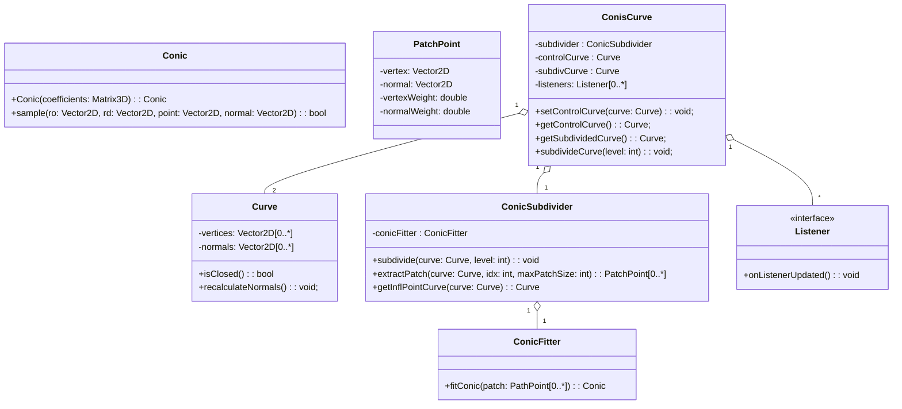

# Conis: A library for Conic Curve Subdivision

Repository containing the implementation of a conic subdivision scheme for curves. This framework was the basis for the paper: [A point-normal interpolatory subdivision scheme preserving conics](https://doi.org/10.1016/j.cagd.2024.102347).

The program supports the loading of object files (provided that the `.obj` file contains a single 2D curve).

## Prerequisites

You need the following to be able to compile and run the project:

* [CMake](https://cmake.org/)
* [Eigen](https://eigen.tuxfamily.org/index.php?title=Main_Page) 
  * ```shell
    sudo apt-get install libeigen3-dev
    ```
* [Qt 6.2+](https://www.qt.io/)
  * Only necessary to run the program with gui. Optional for building the library

## Quick Start

To build and run:

```shell
./build.sh -r
```

## Compilation

Compilation can be done easily via the provided build script:

```shell
./build.sh
```

See `./build.sh --help` for more information on how to use the build script:

```txt
Builds the conis software.

Usage: ./build.sh [options]

options:
  -h, --help:               Shows help output.
  -c, --clean:              Cleans the build directory.
      --skip-cmake:         Skips the cmake step of the build_rpm stage during the build process.
  -d, --debug:              Builds the program in Debug mode instead of Release.
  -t  --test:               Builds and runs the unit tests.
  -r, --run:                Runs the built binary.
  -l, --library-only:       Only builts the core library. No Qt needed to run this
```

Alternatively, you can compile it manually (note that this does not create a _release_ build):
```shell
mkdir build
cd build
cmake ..
make -j6
```

## Usage

Settings:

- Calculation settings can be found in the menu on the left.
- View settings, such as which items to show/hide can be found in the top menu.
- Presets can be found in the top menu.
- Light/dark mode can be enabled via the top right.

Controls:

- Click and drag to move points/normals.
- Right-clicking adds a new point.
- Double-clicking on a normal will reset it.
- Selecting an edge will display the conic constructed based on the patch surrounding said edge (not that this does not automatically insert inflection points)
- Up/Down/Left/Right arrow keys can be used to translate the mesh.

## Design

A simplified diagram of the `core` library:

